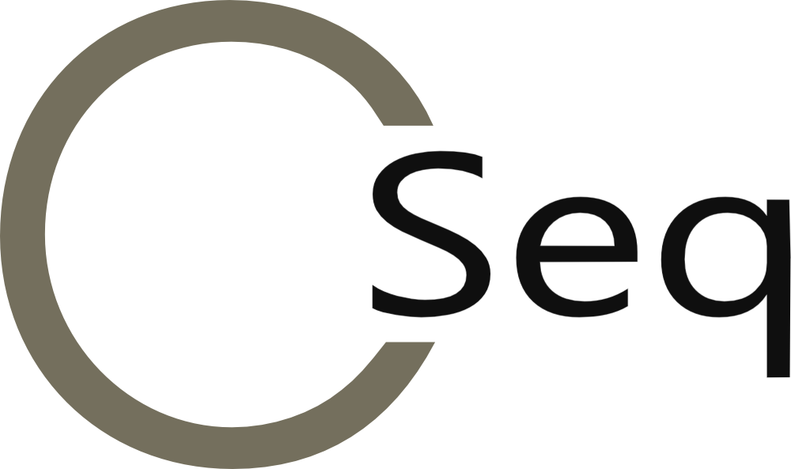

#  A Family of Sequentialization-Based C Verification Tools

Sequentialization is a technique for the analysis of concurrent programs that exploits verification techniques or tools that were originally designed for sequential programs. Sequentialization can be implemented as a code-to-code translation from the concurrent program into a corresponding non-deterministic sequential program that simulates all executions of the original program. The sequential program contains both the mapping of the threads in the form of functions, and an encoding of the scheduler, were the non-determinism allows to handle different concurrent schedules collectively.
This approach has three main advantages:
* a code-to-code translation is typically much easier to implement than a full-fledged analysis tool;
* it allows designers to focus only on the concurrency aspects of programs, delegating all sequential reasoning to an existing target analysis tool;
* sequentializations can be designed to target multiple backends for sequential program analysis.

CSeq is a framework that facilitates the development of code-to-code translations for concurrent C programs with POSIX threads based on sequentialization. The following are verification tools that have been developed under the CSeq framework.

## VeriSmart

VeriSmart is a novel parallel bug-finding framework for concurrent C programs.

**Publications:**
- (full reference missing) <a href="https://eprints.soton.ac.uk/413917/">ASE'17</a>

**Downloads:**
- <a href="verismart-1.0">VeriSmart-1.0</a>(2017.09.11), <a href="./files/ase17_experiments.tar.gz">experiments</a>
    
 
## Lazy-CSeq
 
Lazy-CSeq is a code-to-code transformation tool that translates a multi-threaded C program into a nondeterministic sequential C program that preserves reachability for all round-robin schedules with a given bound on the number of rounds. It re-uses existing high-performance BMC tools as backends for the sequential verification problem. The translation is carefully designed to introduce very small memory overheads and very few sources of nondeterminism, so that it produces tight SAT/SMT formulae, and is thus very effective in practice. The tool has a script that bundles the translation and the verification.
        
**Publications:**
* _Lazy Sequentialization for TSO and PSO via Shared Memory Abstractions_.
    <a href="http://www.ecs.soton.ac.uk/people/et1m11">E. Tomasco</a>,
    <a href="http://users.ecs.soton.ac.uk/tnl2g10/">T. L. Nguyen</a>,
    <a href="http://www.ecs.soton.ac.uk/people/oi2c11">O. Inverso</a>,
    <a href="http://www.cs.sun.ac.za/%7Ebfischer/">B. Fischer</a>,
    <a href="http://www.di.unisa.it/%7Elatorre">S. La Torre</a>, and
    <a href="http://users.ecs.soton.ac.uk/gp4/">G. Parlato</a>.
    Formal Methods in Computer-Aided Design (<a href="http://www.cs.utexas.edu/users/hunt/FMCAD/FMCAD16/index.shtml">FMCAD</a>)
    Mountain View, CA, USA, 2016.
    (<a href="http://eprints.soton.ac.uk/397759/">PDF</a>)</li>
* <a href="http://eprints.soton.ac.uk/379595/">ASE'15</a>
        </li>
* <a href="http://eprints.soton.ac.uk/365365/">CAV'14</a></li>
* <a href="http://eprints.soton.ac.uk/363742/">SV-COMP'14</a>

**Downloads:**
* <a href="lazy-cseq-2.0" onclick="div_show(this);return false;">Lazy-CSeq-2.0</a>  (2017.02.14)
* <a href="lazy-cseq-1.0" onclick="div_show(this);return false;">Lazy-CSeq-1.0</a>  (2016.01.31), <a href="./files/experiment_data.tar.gz">experiments</a> and <a href="./files/lazy-cseq-1.0-demo.mov">demo video</a>
* <a href="lazy-cseq-0.6c" onclick="div_show(this);return false;">Lazy-CSeq-0.6c</a> (<a href="http://sv-comp.sosy-lab.org/2015/">SVCOMP'15</a> version)
          
          
**Awards:** (incomplete)
* Silver medal in <a href="http://sv-comp.sosy-lab.org/2016/results/results-verified/Concurrency.table.html">concurrency category</a> at <a href="http://sv-comp.sosy-lab.org/2016/">SV-COMP'16</a>
* Gold medal in <a  href="http://sv-comp.sosy-lab.org/2015/results/Concurrency.table.html">concurrency category</a> at <a href="http://sv-comp.sosy-lab.org/2015/">SV-COMP'15</a>
* Gold medal in <a href="http://sv-comp.sosy-lab.org/2014/results/Concurrency.table.html">concurrency category</a> at <a href="http://sv-comp.sosy-lab.org/2014/">SV-COMP'14       </a>
        
**Supported backends:** (incomplete)
* <a href="http://www.cprover.org/cbmc/">CBMC</a>
* <a href="http://www.esbmc.org/">ESBMC</a>
* <a href="http://llbmc.org/">LLBMC</a>

## MU-CSeq

MU-CSeq is a code-to-code translation tool for the verification of multi-threaded C programs with POSIX threads. It is based on sequentializing the programs according to a guessed sequence of write operations in the shared memory (memory unwinding, MU). The original algorithm (implemented in MU-CSeq 0.1) stores the values of all shared variables for each write (read-explicit fine-grained MU), which requires multiple copies of the shared variables. Our new algorithms (in MU-CSeq 0.3) store only the writes (read-implicit MU) or only a subset of the writes (coarse-grained MU), which reduces the memory footprint of the unwinding and so allows larger unwinding bounds.

**Publications:**
* ...

**Downloads:**
* ...
          
          
**Awards:** (incomplete)
* ...
        
**Supported backends:** (incomplete)
* ...

    <ul>
      <li>Publications:</li>
      <ul>
        <li><a href="http://eprints.soton.ac.uk/386736/">SV-COMP'16</a></li>
        <li><a href="http://eprints.soton.ac.uk/370322/">TACAS'15</a></li>
        <li><a href="http://eprints.soton.ac.uk/370672/">SV-COMP'15</a> 
        </li>
        <li><a href="http://eprints.soton.ac.uk/363741/">SV-COMP'14</a> 
           
        </li>
      </ul>
      <li> Downloads:</li>
      <ul>
        <li><a href="mu-cseq-0.4" onclick="div_show(this);return false;">MU-CSeq-0.4</a> (<a
            href="http://sv-comp.sosy-lab.org/2016/">SV-COMP'16</a>
          version) 
        </li>
        <li><a href="mu-cseq-0.3" onclick="div_show(this);return false;">MU-CSeq-0.3</a> (<a
            href="http://sv-comp.sosy-lab.org/2015/">SV-COMP'15</a>
          version) 
        </li>
         
      </ul>
      <li>Awards:</li>
      <ul>
        <li>Gold medal in <a href="http://sv-comp.sosy-lab.org/2016/results/results-verified/Concurrency.table.html">concurrency
            category</a> at <a href="http://sv-comp.sosy-lab.org/2016/">SV-COMP'16</a>
        </li>
        <li>Silver medal in <a href="http://sv-comp.sosy-lab.org/2015/results/Concurrency.table.html">concurrency
            category</a> at <a href="http://sv-comp.sosy-lab.org/2015/">SV-COMP'15</a>
        </li>
        <li>Silver medal in <a href="http://sv-comp.sosy-lab.org/2014/results/Concurrency.table.html">concurrency
            category</a> at <a href="http://sv-comp.sosy-lab.org/2014/">SV-COMP'14 
             
          </a></li>
      </ul>
      <li>Supported backends:</li>
      <ul>
        <li><a href="http://www.cprover.org/cbmc/">CBMC 
             
          </a></li>
      </ul>
    </ul>

## UL-CSeq

UL-CSeq is a code-to-code translation tool for the verification of multi-threaded C programs with dynamic thread creation. This tool implements a variation of the lazy sequentialization algorithm implemented in Lazy-CSeq. The main novelty is that UL-CSeq supports an unbounded number of context switches and allow unbounded loops, while the number of allowed threads still remains bounded.

**Publications:**
* _Lazy Sequentialization for the Safety Verification of Unbounded Concurrent Programs_.
        <a href="http://users.ecs.soton.ac.uk/tnl2g10/">T. L. Nguyen</a>,
        <a href="http://www.cs.sun.ac.za/%7Ebfischer/">B. Fischer</a>, 
        <a href="http://www.di.unisa.it/%7Elatorre">S. La Torre</a>, and
        <a href="http://users.ecs.soton.ac.uk/gp4/">G. Parlato</a>.
        14th International Symposium on Automated Technology for
        Verification and Analysis (<a href="http://atva2016.gforge.inria.fr/">ATVA</a>)
        Chiba, Japan, 2016.
        (<a href="http://eprints.soton.ac.uk/397033/">PDF</a>)
* _Unbounded Lazy-CSeq: A Lazy Sequentialization Tool for C with unboundedly many Context Switches (Competition Contribution)_.
        <a href="http://users.ecs.soton.ac.uk/tnl2g10/">T. L. Nguyen</a>,
        <a href="http://www.ecs.soton.ac.uk/people/oi2c11">O. Inverso</a>,
        <a href="http://www.ecs.soton.ac.uk/people/et1m11">E. Tomasco</a>,
        <a href="http://www.cs.sun.ac.za/%7Ebfischer/">B. Fischer</a>,
        <a href="http://www.di.unisa.it/%7Elatorre">S. La Torre</a>, and
        <a href="http://users.ecs.soton.ac.uk/gp4/">G. Parlato</a>.
        5th Intl. Competition on Software Verification (<a href="http://sv-comp.sosy-lab.org/2016/">SV-COMP</a>), held at
        <a href="http://www.etaps.org/2016/tacas">TACAS,</a>
        Eindhoven, The Netherlands, 2016.
        (<a href="http://eprints.soton.ac.uk/387011/">PDF</a>)
* _Unbounded Lazy-CSeq: A Lazy Sequentialization Tool for C Programs with Unbounded Context Switches (Competition Contribution)_.
   <a href="http://users.ecs.soton.ac.uk/tnl2g10/">T. L. Nguyen</a>,
   <a href="http://www.cs.sun.ac.za/%7Ebfischer/">B. Fischer</a>,
   <a href="http://www.di.unisa.it/%7Elatorre">S. La Torre</a>, and
   <a href="http://users.ecs.soton.ac.uk/gp4/">G. Parlato</a>.
   4th Intl. Competition on Software Verification (<a href="http://sv-comp.sosy-lab.org/2015/">SV-COMP</a>), 
   held at <a href="http://www.etaps.org/2015/tacas">TACAS</a>, London, UK, 2015.
   (<a href="http://eprints.soton.ac.uk/370672/">PDF</a>)

**Downloads:**
* <a href="ul-cseq-0.2">UL-CSeq-0.2</a> (<a href="http://atva2016.gforge.inria.fr/">ATVA'16</a> version)
* <a href="ul-cseq-0.1">UL-CSeq-0.1</a> (<a href="http://sv-comp.sosy-lab.org/2015/">SV-COMP'15</a> version)
          
          
**Awards:** (incomplete)
* ...
        
**Supported backends:** (incomplete)
* <a href="http://www.cprover.org/cbmc/">CBMC</a>
* <a href="http://cpachecker.sosy-lab.org/">CPAChecker</a>
* <a href="http://seahorn.github.io/">SeaHorn</a>
* <a href="https://monteverdi.informatik.uni-freiburg.de/tomcat/Website/?ui=tool&amp;tool=automizer">Ultimate Automizer</a>
* <a href="http://vvt.forsyte.at/">VVT</a

      <li>SV-COMP results:</li>
      <ul>
        <li><a href="http://sv-comp.sosy-lab.org/2016/results/results-verified/Concurrency.table.html">2016</a>
        </li>
        <li><a             href="http://sv-comp.sosy-lab.org/2015/results/Concurrency.table.html">2015</a>
        </li>
      </ul>

    
## LR CSeq

LR-CSeq is a code-to-code translation tool which implements a novel sequentialization for C programs using POSIX threads, which extends the Lal/Reps sequentialization schema to support dynamic thread creation.
    
**Publications:**
* _CSeq: A Concurrency Pre-processor for Sequential C Verification Tools (Tool Demonstration)_.
        <a href="http://www.cs.sun.ac.za/%7Ebfischer/">B. Fischer</a>, <a
          href="http://www.ecs.soton.ac.uk/people/oi2c11">O. Inverso</a>,
        and <a href="http://users.ecs.soton.ac.uk/gp4/">G. Parlato</a>. 
        28th IEEE/ACM International Conference on Automated Software
        Engineering (<a href="http://ase-conferences.org/ase/past/ase2013/">ASE</a>),
        Palo Alto, CA, USA, 2013.
        (<a href="http://eprints.soton.ac.uk/365366/">PDF</a>)
* _CSeq: A Sequentialization Tool for C (Competition Contribution)_.
        <a href="http://www.cs.sun.ac.za/%7Ebfischer/">B. Fischer</a>, <a
          href="http://www.ecs.soton.ac.uk/people/oi2c11">O. Inverso</a>,
        and <a href="http://users.ecs.soton.ac.uk/gp4/">G. Parlato</a>.
        2nd Intl. Competition on Software Verification (<a href="http://sv-comp.sosy-lab.org/2013/">SV-COMP</a>), held at
        <a href="http://www.etaps.org/index.php/2013/tacas">TACAS</a>, Rome, Italy, 2013.
        (<a href="http://eprints.soton.ac.uk/351904/">PDF</a>)

**Downloads:**
* <a href="lr-cseq-0.5">CSeq-0.5</a> (ASE version,
          includes benchmarks, <a href="./files/cseq-0.5-demo.mov">demo video</a>)
* <a href="lr-cseq-0.1a">CSeq-0.1a</a> (<a href="http://sv-comp.sosy-lab.org/2013/">SV-COMP'13</a> version)
          
          
**Awards:**
* Silver medal in <a  href="http://sv-comp.sosy-lab.org/2013/results/concurrency.table.html">concurrency category</a> at <a href="http://sv-comp.sosy-lab.org/2013/">SV-COMP'13</a>
        
**Supported backends:** (incomplete)
* ...

## Publications (to be deleted)

    <ol>
      <li><b>Lazy Sequentialization for TSO and PSO via Shared Memory
          Abstractions</b> 
        <a href="http://www.ecs.soton.ac.uk/people/et1m11">E. Tomasco</a>,
        <a href="http://users.ecs.soton.ac.uk/tnl2g10/">T. L. Nguyen</a>,
        <a href="http://www.ecs.soton.ac.uk/people/oi2c11">O. Inverso</a>,
        <a href="http://www.cs.sun.ac.za/%7Ebfischer/">B. Fischer</a>, <a
          href="http://www.di.unisa.it/%7Elatorre">S. La Torre</a>, and
        <a href="http://users.ecs.soton.ac.uk/gp4/">G. Parlato</a>. 
        Formal Methods in Computer-Aided Design (<a
          href="http://www.cs.utexas.edu/users/hunt/FMCAD/FMCAD16/index.shtml">FMCAD</a>) 
        Mountain View, CA, USA,&nbsp; 2016. 
        (<a href="http://eprints.soton.ac.uk/397759/">PDF</a>)</li>
       

      <li><b>MU-CSeq 0.4: IndividualMemory Location Unwindings
          (Competition Contribution)</b> 
        <a href="http://www.ecs.soton.ac.uk/people/et1m11">E. Tomasco</a>,
        <a href="http://users.ecs.soton.ac.uk/tnl2g10/">T. L. Nguyen</a>,
        <a href="http://www.ecs.soton.ac.uk/people/oi2c11">O. Inverso</a>,
        <a href="http://www.cs.sun.ac.za/%7Ebfischer/">B. Fischer</a>, <a
          href="http://www.di.unisa.it/%7Elatorre">S. La Torre</a>, and
        <a href="http://users.ecs.soton.ac.uk/gp4/">G. Parlato</a>. 
        5th Intl. Competition on Software Verification (<a
          href="http://sv-comp.sosy-lab.org/2016/">SV-COMP</a>), held at
        <a href="http://www.etaps.org/2016/tacas">TACAS,</a> 
        Eindhoven, The Netherlands,&nbsp; 2016. 
        (<a href="http://eprints.soton.ac.uk/386736/">PDF</a>)  
         
      </li>
      <li><b>Lazy-CSeq 1.0 (Competition Contribution)</b> 
        <a href="http://www.ecs.soton.ac.uk/people/oi2c11">O. Inverso</a>,
        <a href="http://users.ecs.soton.ac.uk/tnl2g10/">T. L. Nguyen</a>,
        <a href="http://www.ecs.soton.ac.uk/people/et1m11">E. Tomasco</a>,
        <a href="http://www.cs.sun.ac.za/%7Ebfischer/">B. Fischer</a>, <a
          href="http://www.di.unisa.it/%7Elatorre">S. La Torre</a>, and
        <a href="http://users.ecs.soton.ac.uk/gp4/">G. Parlato</a>. 
        5th Intl. Competition on Software Verification (<a
          href="http://sv-comp.sosy-lab.org/2016/">SV-COMP</a>), held at
        <a href="http://www.etaps.org/2016/tacas">TACAS,</a> 
        Eindhoven, The Netherlands,&nbsp; 2016. 
        (<a href="http://eprints.soton.ac.uk/387010/">PDF</a>)  
         
      </li>

      <li><b>Bounded Model Checking of Multi-threaded Programs via
          Sequentialization</b> 
        <a href="http://www.ecs.soton.ac.uk/people/oi2c11">O. Inverso</a>. 
        PhD Thesis, University of Southampton,&nbsp; 2015. 
        (<a href="http://eprints.soton.ac.uk/386739/">PDF</a>)  
         
      </li>
      <li><b>Lazy-CSeq: A Context-Bounded Model Checking Tool for
          Multi-Threaded C-Programs (Tool Demonstration)</b> 
        <a href="http://www.ecs.soton.ac.uk/people/oi2c11">O. Inverso</a>,
        <a href="http://users.ecs.soton.ac.uk/tnl2g10/">T. L. Nguyen</a>,
        <a href="http://www.cs.sun.ac.za/%7Ebfischer/">B. Fischer</a>, <a
          href="http://www.di.unisa.it/%7Elatorre">S. La Torre</a>, and
        <a href="http://users.ecs.soton.ac.uk/gp4/">G. Parlato</a>. 
        30th IEEE/ACM International Conference on Automated Software
        Engineering (<a href="http://ase2015.unl.edu/">ASE</a>), 
        Lincoln, Nebraska, USA,&nbsp; 2015. 
        (<a href="http://eprints.soton.ac.uk/379595/">PDF</a>)  
         
      </li>
      <li><b>Verifying Concurrent Programs by Memory Unwinding</b> 
        <a href="http://www.ecs.soton.ac.uk/people/et1m11">E. Tomasco</a>,
        <a href="http://www.ecs.soton.ac.uk/people/oi2c11">O. Inverso</a>,
        <a href="http://www.cs.sun.ac.za/%7Ebfischer/">B. Fischer</a>, <a
          href="http://www.di.unisa.it/%7Elatorre">S. La Torre</a>, and
        <a href="http://users.ecs.soton.ac.uk/gp4/">G. Parlato</a>. 
        21st Int'l Conference on Tools and Algorithms for the
        Construction and Analysis of Systems (<a
          href="http://www.etaps.org/2015/tacas">TACAS</a>), 
        London, UK,&nbsp; 2015. 
        (<a href="http://eprints.soton.ac.uk/370322/">PDF</a>)  
         
      </li>
      <li><b>Lazy-CSeq 0.6c: An Improved Lazy Sequentialization Tool for
          C (Competition Contribution)</b> 
        <a href="http://www.ecs.soton.ac.uk/people/oi2c11">O. Inverso</a>,
        <a href="http://www.ecs.soton.ac.uk/people/et1m11">E. Tomasco</a>,
        <a href="http://www.cs.sun.ac.za/%7Ebfischer/">B. Fischer</a>, <a
          href="http://www.di.unisa.it/%7Elatorre">S. La Torre</a>, and
        <a href="http://users.ecs.soton.ac.uk/gp4/">G. Parlato</a>. 
        4th Intl. Competition on Software Verification (<a
          href="http://sv-comp.sosy-lab.org/2015/">SV-COMP</a>), held at
        <a href="http://www.etaps.org/2015/tacas">TACAS,</a> 
        London, UK,&nbsp; 2015. 
        (<a href="http://eprints.soton.ac.uk/370673/">PDF</a>) 
         
      </li>
      <li><b>MU-CSeq 0.3: Sequentialization by Read-implicit and
          Coarse-grained Memory Unwindings (Competition Contribution) 
        </b><a href="http://www.ecs.soton.ac.uk/people/et1m11">E.
          Tomasco</a>, <a
          href="http://www.ecs.soton.ac.uk/people/oi2c11">O. Inverso</a>,
        <a href="http://www.cs.sun.ac.za/%7Ebfischer/">B. Fischer</a>, <a
          href="http://www.di.unisa.it/%7Elatorre">S. La Torre</a>, and
        <a href="http://users.ecs.soton.ac.uk/gp4/">G. Parlato</a>. 
        4th Intl. Competition on Software Verification (<a
          href="http://sv-comp.sosy-lab.org/2015/">SV-COMP</a>), held at
        <a href="http://www.etaps.org/2015/tacas">TACAS</a>, 
        London, UK,&nbsp; 2015. 
        (<a href="http://eprints.soton.ac.uk/370671/">PDF</a>) 
         
      </li>

      <li>
        <meta http-equiv="content-type" content="text/html;
          charset=UTF-8">
        <b>Bounded Model Checking of Multi-Threaded C Programs via Lazy
          Sequentialization</b> 
        <a href="http://www.ecs.soton.ac.uk/people/oi2c11">O. Inverso</a>,
        <a href="http://www.ecs.soton.ac.uk/people/et1m11">E. Tomasco</a>,
        <a href="http://www.cs.sun.ac.za/%7Ebfischer/">B. Fischer</a>, <a
          href="http://www.di.unisa.it/%7Elatorre">S. La Torre</a>, and
        <a href="http://users.ecs.soton.ac.uk/gp4/">G. Parlato</a>. 
        26th Int'l Conference on Computer Aided Verification (<a
          href="http://eprints.soton.ac.uk/365365/">CAV</a>), 
        Vienna, Austria, 2014. 
        (<a href="http://eprints.soton.ac.uk/365365/">PDF</a>)  
         
      </li>
      <li><b>Lazy-CSeq: A Lazy Sequentialization Tool for C (Competition
          Contribution)</b> 
        <a href="http://www.ecs.soton.ac.uk/people/oi2c11">O. Inverso</a>,
        <a href="http://www.ecs.soton.ac.uk/people/et1m11">E. Tomasco</a>,
        <a href="http://www.cs.sun.ac.za/%7Ebfischer/">B. Fischer</a>, <a
          href="http://www.di.unisa.it/%7Elatorre">S. La Torre</a>, and
        <a href="http://users.ecs.soton.ac.uk/gp4/">G. Parlato</a>. 
        3rd Intl. Competition on Software Verification (<a
          href="http://sv-comp.sosy-lab.org/2014/">SV-COMP</a>), held at
        <a href="http://www.etaps.org/index.php/2014/tacas">TACAS</a>, 
        Grenoble, France, 2014 
        (<a href="http://eprints.soton.ac.uk/363742/">PDF</a>) 
         
      </li>
      <li> <b>MU-CSeq: Sequentialization of C Programs by Shared Memory
          Unwindings (Competition Contribution)</b> 
        <a href="http://www.ecs.soton.ac.uk/people/et1m11">E. Tomasco</a>,
        <a href="http://www.ecs.soton.ac.uk/people/oi2c11">O. Inverso</a>,
        <a href="http://www.cs.sun.ac.za/%7Ebfischer/">B. Fischer</a>, <a
          href="http://www.di.unisa.it/%7Elatorre">S. La Torre</a>, and
        <a href="http://users.ecs.soton.ac.uk/gp4/">G. Parlato</a>. 
        3rd Intl. Competition on Software Verification (<a
          href="http://sv-comp.sosy-lab.org/2014/">SV-COMP</a>), held at
        <a href="http://www.etaps.org/index.php/2014/tacas">TACAS</a>,  
        Grenoble, France, 2014 
        (<a href="http://eprints.soton.ac.uk/363741/">PDF</a>)  
         
      </li>
    </ol>
    <ul>
    </ul>
    
    
## People

CSeq is developed by:
* <a href="http://www.ecs.soton.ac.uk/people/oi2c11">Omar
          Inverso</a> (University of Southampton, UK)
* <a href="http://users.ecs.soton.ac.uk/tnl2g10/">Truc L. Nguyen</a>
        (University of Southampton, UK)
* <a href="http://www.ecs.soton.ac.uk/people/et1m11">Ermenegildo
          Tomasco</a> (University of Southampton, UK)
* <a href="http://www.cs.sun.ac.za/%7Ebfischer/">Bernd Fischer</a>
        (University of Stellenbosch, South Africa) 
* <a href="http://www.di.unisa.it/%7Elatorre">Salvatore La Torre</a>
        (University of Salerno, Italy)
* <a href="http://users.ecs.soton.ac.uk/gp4/">Gennaro Parlato</a>
        (University of Southampton, UK)
 
## Funding
    This project is partially supported by <a
      href="http://gow.epsrc.ac.uk/NGBOViewGrant.aspx?GrantRef=EP/M008991/1">EPSRC</a>. 
     
